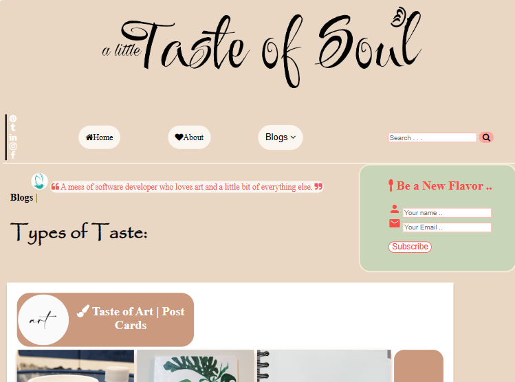
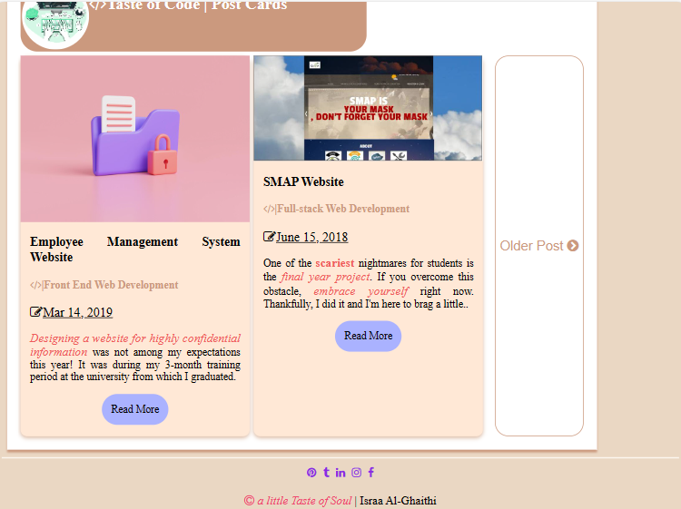
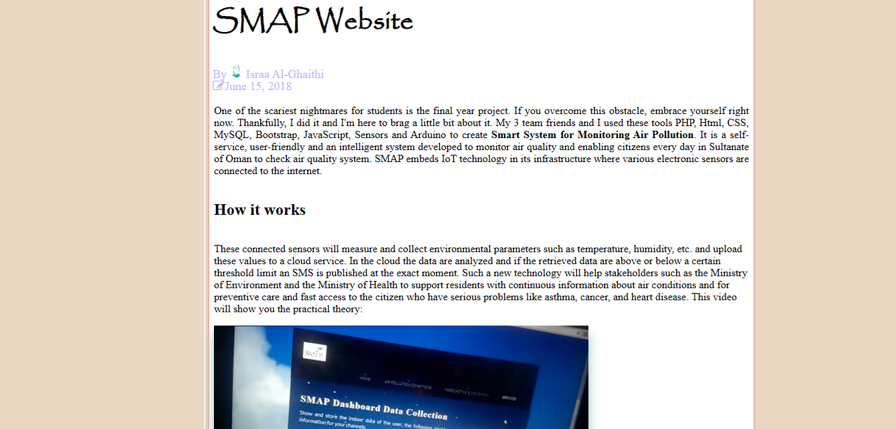

# Personal Blog Website

## Table of Content

- [Description](#description)
- [Website Preview](#website-preview)
- [Technologies](#technologies)
- [Usage](#usage)
- [Development](#development)
    - [Prerequisites](#prerequisites)
    - [Getting Started](#getting-started)
    - [Contributing](#contributing)
- [License](#license)

## Description

[Back to top](#table-of-content)

This project is a personal blog website built from scratch using HTML and CSS. It showcases my front-end web development skills and design capabilities. While using and including the following features:

- Responsive design for optimal viewing on various devices.
- Custom layout, typography, and styling elements.
- Integration of interactive features and animations using CSS.
- Cross-browser compatibility and smooth performance.
- use Flexbox and Grid to easily create a layout.

## Website Preview

[Back to top](#table-of-content)

***

***

***

## Technologies

[Back to top](#table-of-content)

The languages used:

- HTML5
- CSS

Code Editor:

- Visual Studio Code

## Usage

[Back to top](#table-of-content)

How to use and functioned this project.

1. Clone the repository to local machine
2. Open the index.html file in preferred web browser
3. Explore the different pages and blog posts on the website

## Development

[Back to top](#table-of-content)

### Prerequisites

[Back to top](#table-of-content)

Before you start, ensure you have the following software installed on your computer:

- Web browser (e.g., Chrome, Firefox)
- Text editor or Integrated Development Environment (IDE)

### Getting Started

[Back to top](#table-of-content)

Follow these steps to get the project up and running on your local machine:

1. Clone this repository: [Personal Blog Website project repo](https://github.com/Israa-AlGhaithi/Personal-Blog-Website-Udacity-project.git).
2. Open the project in your preferred text editor or IDE.
3. Open the `index.html` file in your web browser.

### Contributing

[Back to top](#table-of-content)

If you'd like to contribute to this project, follow these steps:

1. Fork the repository.
2. Create a new branch: > git checkout <branch-name>
3. Make your changes and commit them: > git commit
4. Push to the branch
5. Submit a pull request.

## License

[Back to top](#table-of-content)

©a little Taste of Soul \| Israa Al-Ghaithi
